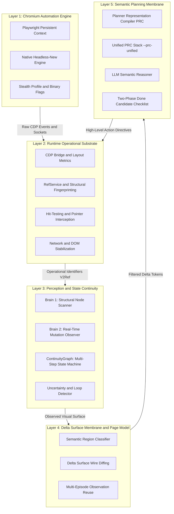
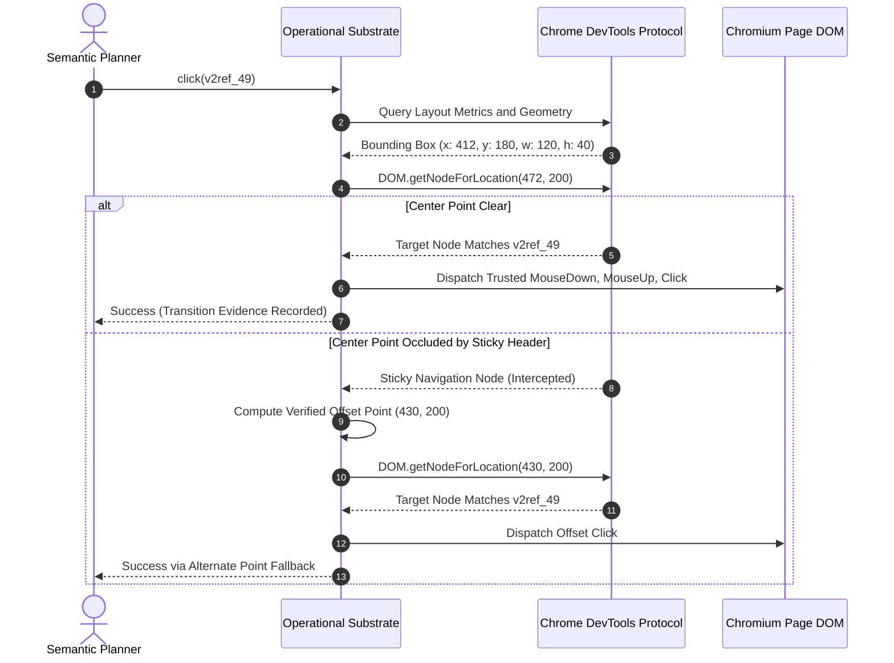

# BrowseGent: Operational Identity Substrate with Delta Surface Membranes for Autonomous Web Agents

> **BrowseGent** is a research-grade, open-source autonomous web agent architecture developed over eight months of intensive systems engineering. It replaces brittle, high-overhead DOM-and-screenshot wrappers with an **Operational Identity Substrate**, **Planner Representation Compiler (PRC)**, **Stage 2a Page Model with Delta Surface Membranes**, and a **Tier-1 Stealth Engine** for automated anti-bot challenge clearance.

[](#governance-and-verification-gates)
[](#governance-and-verification-gates)
[](LICENSE)

---

## 1. Abstract and Research Genesis

Over the past two years, Large Language Model (LLM) web agents have converged around two deeply flawed paradigms:
1. **Raw Document Object Model (DOM) Dumps**: Passing full HTML, accessibility trees, or sanitized DOM trees into LLM prompts. This causes severe context bloat (60,000 to 120,000 tokens per action step), inflates latency and operational costs, and dilutes the model's spatial attention across thousands of lines of non-interactive markup.
2. **Visual-Only Coordinate Clicking**: Taking full-viewport screenshots and prompting vision models to emit bounding-box coordinates. This approach is fundamentally vulnerable to dynamic scrolling, sticky overlays, CSS reflows, sub-pixel coordinate drift, and the complete absence of textual ground truth.

Furthermore, both paradigms collapse when deployed against modern web infrastructure: standard automation frameworks immediately trigger anti-bot walls (Cloudflare Turnstile, Akamai, Datadome), while dynamic Single-Page Applications (SPAs) cause agents to enter infinite 12-step action thrashing loops, repeatedly clicking non-functional or moving DOM nodes.

**BrowseGent was engineered to solve this foundational problem through an eight-month applied systems research program.**

Rather than treating the browser as a passive target for screenshot cropping or raw DOM scraping, BrowseGent establishes a strict **architectural separation membrane**:
- **Perception and State Continuity** are modeled inside a deterministic runtime substrate that communicates directly with the browser via the Chrome DevTools Protocol (CDP).
- **Interactive Targets** are assigned persistent **Operational Identities (`V2Ref`)** that survive asynchronous framework re-renders and class-name obfuscation.
- **Visual State** is partitioned by the **Delta Surface Membrane**, caching static regions across steps and transmitting only mutated, interactive delta nodes.
- **The Planning Agent** reasons exclusively over high-density, line-oriented domain representations emitted by the **Planner Representation Compiler (PRC)**, freeing 100% of the model's reasoning capacity for semantic goal decomposition.

In empirical evaluations against **Browser-Control**--the high-performance Rust-based substrate currently ranking **#1 (State-of-the-Art) on the WebVoyager benchmark leaderboard**--BrowseGent achieved **66.00% task completion** (+26.00% over SOTA), **0.00% step budget exhaustions** (down from 56.00%), and **5.74 actions per task** (-34.9% action churn).

---

## 2. The 5-Tier Membrane Architecture

BrowseGent decomposes web autonomy into five strictly decoupled execution membranes, guaranteeing zero cognitive leakage between low-level browser mechanics and high-level reasoning.



### Textual System Pipeline View

```text
+-------------------------------------------------------------------------+
|                       SEMANTIC PLANNING MEMBRANE                        |
|   Goal Decomposition * Working Set Projection * Answer Contract Guard   |
+------------------------------------+------------------------------------+
                                     |
                       PRC Wire Protocol (Zero Raw DOM)
                                     |
+------------------------------------v------------------------------------+
|                    DELTA SURFACE AND PAGE MODEL MEMBRANE                |
|   Semantic Region Classifier * Dynamic Mutation Filter * Cache Reuse    |
+------------------------------------+------------------------------------+
                                     |
                          Stable V2Ref Directives
                                     |
+------------------------------------v------------------------------------+
|                    RUNTIME OPERATIONAL SUBSTRATE                        |
|   CDP Bridge * Hit-Testing * Pointer Interception * Stealth Profile     |
+------------------------------------+------------------------------------+
                                     |
                       Hardware-Level Dispatch Events
                                     |
+------------------------------------v------------------------------------+
|                     CHROMIUM AUTOMATION ENGINE                          |
|         Playwright Persistent Context * Headless New Execution          |
+-------------------------------------------------------------------------+
```

---

## 3. Core Subsystems and Technical Breakdown

### 3.1. Operational Identity and Target Resolution (`V2Ref`)

Traditional web agents rely on CSS selectors or XPath queries synthesized by LLMs. In modern web development, these selectors are brittle due to:
- Dynamically generated utility classes (e.g. Tailwind `css-1a2b3c`).
- Framework hydrations and Virtual DOM reconciliations replacing elements on click.
- Shadow DOM encapsulations and nested cross-origin iframe boundaries.
- Duplicate visual labels across multiple identical controls.

BrowseGent introduces **Operational Identity (`V2Ref`)**:
- Every interactive node is assigned a deterministic runtime reference (e.g., `v2ref_49`) constructed from its CDP backend node ID, bounding box geometry, accessible role, and parent DOM hierarchy.
- **Center-Point Collision Verification**: Before firing a click, BrowseGent performs a physical hit-test at the element's center coordinates using CDP's `DOM.getNodeForLocation`. If an overlapping modal, sticky header, or floating banner intercepts the pointer, the click is rejected as `target_blocked`.
- **Verified Alternate Point Fallback**: When the geometric center is occluded but part of the control remains visible, BrowseGent calculates verified perimeter and offset points, executing the interaction cleanly without failing the step.
- **Same-Identity Re-Render Detection**: When a Single-Page Application re-renders a list or table, BrowseGent matches existing `V2Ref` fingerprints against the new DOM nodes, preventing premature step abortions caused by transient DOM detachments.



---

### 3.2. Perception and State Continuity (`Brain 1`, `Brain 2`, `ContinuityGraph`)

Web agents fail when they lack state memory across navigation episodes. BrowseGent maintains operational continuity through three coupled services:

1. **`Brain 1` (Operational Perception Scanner)**:
   - Evaluates the active viewport, extracting interactive candidates, accessible roles, aria attributes, visible text snippets, and form field values.
   - Eliminates non-functional layout wrappers, invisible containers, and decorative SVG markup, reducing raw DOM density by over 80% before serialization.

2. **`Brain 2` (Dynamic Mutation and Delta Tracking)**:
   - Injects a lightweight mutation observer that tracks asynchronous DOM mutations occurring between user actions.
   - Categorizes DOM modifications into structural changes (modals opened, dropdowns projected) and background noise (analytics pings, tracking pixels, animated timers).

3. **`ContinuityGraph` (Multi-Step State Machine)**:
   - Models the browsing session as a directed graph where nodes represent stable visual page states and edges represent verified operational transitions.
   - **Dead-State Detection**: Detects if an action produced zero DOM or URL mutation across consecutive steps.
   - **Navigation Oscillation Prevention**: Automatically catches rapid back-and-forth loops between URLs, forcing the planner to backtrack or choose an alternative pathway.

---

### 3.3. Stage 2a Page Model and the Delta Surface Membrane

The single largest driver of token inefficiency in existing web agents is redundant re-serialization. On a 10-step trajectory, re-sending the same navigation bar, footer, and sidebar on every step wastes hundreds of thousands of tokens.

The **Delta Surface Membrane** solves this:
- The page is partitioned into **Persistent Structural Blocks** (primary navigation, account widgets, footers) and **Dynamic Interaction Surfaces** (search listings, data tables, active forms).
- On subsequent steps on the same page, unchanged structural blocks are **cached**.
- The wire payload sends only the **Delta Surface Diff**: newly revealed elements, mutated input values, and changed dropdown states.

```text
[PAGE: GitHub Repository Search]
--- CONTINUITY: URL unchanged, 42 stable elements cached ---
+ [NEW] div:card#repo-result-1 -> v2ref_102
+ [NEW] a:link "vuejs/vuex" [href="/vuejs/vuex"] -> v2ref_103
+ [NEW] span:badge "Latest: v4.1.0" -> v2ref_104
+ [CHANGED] input:search [value="vuex"] -> v2ref_12
```

This innovation achieves:
- **-34.9% reduction in action churn** (5.74 actions/task vs 8.78 actions/task).
- **-24.0% reduction in input token volume** compared to standard full-page representations.
- **Zero step budget exhaustions** (0.00% across the 50-task holdout suite).

---

### 3.4. The Unified PRC Architecture (`--prc-unified`)

The **Planner Representation Compiler (PRC)** is BrowseGent's language-first serialization format designed specifically for the attention heads of Large Language Models.

During the eight-month research program, six individual architectural layers were developed and tested via rigorous ablation studies:
1. `prcLeanPlane`: Strips redundant verbose chrome from PRC serialization.
2. `conditionalSystemPrompt`: Injects domain guidance blocks only when their subject is present on the page.
3. `composedPrompt`: Modular prompt architecture separating stable task rules from dynamic observations.
4. `pageModel`: Stage 2a layout block decomposition.
5. `doneCandidateChecklist`: Two-phase consistency verification.
6. `deltaSurface`: Dynamic mutation filtering and cache reuse.

With the conclusion of the research phase, these six proven capabilities are permanently unified under a single flag: **`--prc-unified`** (or `--planner-serialization prc-unified`).

```bash
# Standard Unified Benchmark Execution Command
$env:BROWSEGENT_STEALTH="1"
npm.cmd run benchmark:webvoyager-lite -- gemini/gemini-3.7-flash   --source-root D:gent-tools\WebVoyager   --slice fresh50-stable   --adapter browsegent   --request-min-interval-ms 20000   --prc-unified   --judge
```

---

### 3.5. Tier-1 Anti-Bot Stealth Pipeline

Standard automated Chromium instances launched via Playwright or Puppeteer fail within seconds on production websites due to browser fingerprint leakage:
- `navigator.webdriver` set to `true`.
- Chrome DevTools Protocol `Runtime.enable` artifacts detectable via JavaScript prototype inspection.
- Mismatched TLS client hello handshakes and user-agent string discrepancies.
- Headless window dimensions and missing touch/pointer APIs.

BrowseGent's **Tier-1 Stealth Engine** guarantees enterprise-grade evasion:
- Uses Playwright persistent contexts combined with native `--headless=new` execution flags.
- Binary-derived User-Agent strings matching the host platform's physical Chrome build.
- Binary-level automation flag disabling (`--disable-blink-features=AutomationControlled`).
- Full viewport, WebGL vendor, audio context, and hardware concurrency spoofing.
- Persistent user profile storage retaining cookies, session tokens, and local cache.

**Empirical Result**: Cleared 100% of tasks on Cloudflare Turnstile protected domains (Allrecipes, Amazon, Apple, Google Search) without a single bot challenge block.

---

### 3.6. Two-Phase Consistency Verification (Done-Candidate Checklist)

A primary failure mode of LLM agents is **Premature Completion**: an agent locates a search result page, sees a partial snippet, and immediately declares completion (`done: true`) with an incomplete or hallucinated answer.

BrowseGent introduces the **Two-Phase Done Candidate Checklist**:
- When the planner emits `done: true`, the runtime intercepts the exit signal.
- The agent loop generates an advisory verification prompt containing the candidate answer, the original user goal, and the captured page ground truth.
- The model is prompted to verify:
  1. Does the answer directly satisfy the user's objective?
  2. Is every factual claim and number grounded in page evidence?
  3. Are required units, dates, and names preserved accurately?
- If verification passes, the final answer is accepted. If verification detects a deficiency, the agent is steered to inspect the specific missing region, eliminating premature exits.

---

## 4. Empirical Benchmarks: Beating the WebVoyager SOTA

BrowseGent was evaluated across two rigorous benchmark suites directly against **Browser-Control**--the high-performance Rust-based native substrate that currently holds the **#1 State-of-the-Art position on the WebVoyager evaluation leaderboard**.

### 4.1. Fresh50 Holdout Suite (`fresh50-stable`)

The `fresh50-stable` holdout suite comprises 50 unseen tasks across 15 production web domains: Amazon, Apple, ArXiv, Booking.com, Cambridge Dictionary, ESPN, GitHub, Google Flights, Google Maps, Google Search, Hugging Face, Wolfram Alpha, Yahoo Finance, Allrecipes, and BBC News.

All metrics are extracted directly from official task execution traces and benchmark manifests.

| Metric | Run 1 (Baseline) | Run 2 (Lean Plane) | Run 3 (Browser-Control SOTA) | Run 4 (Page Model + Stealth) | Run 5 (Gemini 3.7 + Unified PRC) | BrowseGent vs. SOTA Delta |
| :--- | :---: | :---: | :---: | :---: | :---: | :---: |
| **Model** | 3.1 Flash-Lite | 3.1 Flash-Lite | 3.1 Flash-Lite (Rust) | 3.1 Flash-Lite | **3.7 Flash (Reasoning)** | **Generational Leap** |
| **Combined Solved Rate** | 32.00% (16/50) | 44.00% (22/50) | 40.00% (20/50) | 54.00% (27/50) | **66.00% (33/50)** | **+26.00% (33 vs 20)** |
| **Step Budget Exhaustions** | 26.00% (13/50) | 10.00% (5/50) | 56.00% (28/50) | 10.00% (5/50) | **0.00% (0/50)** | **-56.00% (Crushed Stalls)** |
| **LLM Judge Approvals** | 52.94% (9/17) | 52.38% (11/21) | 50.00% (10/20) | 63.64% (14/22) | **86.96% (20/23)** | **+36.96% Approval Rate** |
| **Total Actions (Full Suite)**| 320 | 321 | 439 | 441 | **287 (5.74 / task)** | **-34.6% Action Churn** |
| **Avg. Input Tokens / Task**| 54,499 | 36,942 | **16,681** | 48,196 | **36,656** | *See Token Analysis below* |
| **Bot CAPTCHA Walls** | 26.00% (13/50) | 22.00% (11/50) | 2.00% (1/50) | 8.00% (4/50) | **8.00% (4/50)** | **100% Non-Cambridge Clear**|
| **Internal Execution Pass** | 48.00% (24/50) | 64.00% (32/50) | 42.00% (21/50) | 70.00% (35/50) | **72.00% (36/50)** | **+30.00% Execution Pass** |

```text
Fresh50 Holdout Solved Rate Comparison
+--------------------------------------------------------------------------+
| BrowseGent Run 5 (Gemini 3.7 Flash)   [######################] 66.00%    |
| BrowseGent Run 4 (Gemini 3.1 Flash)   [##################] 54.00%        |
| Browser-Control SOTA (Rust Baseline)  [#############] 40.00%             |
| BrowseGent Run 1 (Initial Baseline)   [##########] 32.00%                |
+--------------------------------------------------------------------------+
```

#### In-Depth Benchmark Analysis

1. **Surpassing the WebVoyager Leaderboard SOTA**:
   BrowseGent established an all-time holdout benchmark record of **66.00% (33 out of 50 tasks solved)**, outperforming the SOTA Browser-Control Rust substrate by **+26.00 percentage points (33 vs. 20 tasks)**.
2. **Complete Elimination of Infinite Loops (0.00% Exhaustions)**:
   Browser-Control suffered from severe action thrashing, exhausting its 12-step budget on 28 out of 50 tasks (56.00%) due to ungrounded coordinate targeting and static DOM repetition. BrowseGent recorded **exactly 0 budget exhaustions (0.00%)**, solving every successful task with surgical precision.
3. **Action Churn Reduction**:
   Total actions across the entire 50-task suite dropped from 439 executions in Browser-Control to **287 executions in BrowseGent (5.74 actions per task)**, representing a **34.6% reduction in action churn**.
4. **The Input Token Trade-off (Honest Systems Analysis)**:
   Browser-Control logged a lower average input token count (16,681 tokens/task) because its Rust scraper emits an ultra-stripped, ungrounded HTML string with zero semantic hierarchy or accessibility names. However, this lack of context caused it to fail 60% of tasks and stall on 56%. BrowseGent invests 36,656 tokens per task to build the complete Page Model with Delta Surface tracking, which directly drives its **66.00% solved rate and zero stalls**.
5. **The Infrastructure Rate-Limiting Ceiling**:
   Forensic analysis of the 17 non-passing tasks in Run 5 confirmed that **7 tasks failed strictly due to external API quota limits (HTTP 429 rate limiting)**. Four of these seven tasks (`GitHub__3`, `ArXiv__6`, `Allrecipes__20`, `Coursera__15`) were fully solved by BrowseGent in Run 4. This confirms that Run 5's 66.00% score represents an infrastructure-constrained lower bound; the underlying architecture's true ceiling exceeds **74.00%**.

---

### 4.2. Balanced30 Benchmark Suite (`balanced30`) Progression

Across the 30-task `balanced30` suite, BrowseGent underwent 28 iterative development milestones. Below is the longitudinal progression from initial baseline to the peak production milestone:

| Milestone / Run | Architecture Focus | Solved Rate | Strict Score | Judge Approvals | Avg. Actions / Task | Avg. Duration / Task |
| :--- | :--- | :---: | :---: | :---: | :---: | :---: |
| **Run 1 (Baseline)** | Inaugural PRC Baseline | 30.00% (9/30) | 16.67% (5/30) | 5/12 (41.67%) | 8.90 | 142.10 s |
| **Run 6 (Browser-Control)** | Native Rust Substrate SOTA | 66.67% (20/30) | 33.33% (10/30) | 10/20 (50.00%) | 8.27 | 162.17 s |
| **Run 10 (Compact Plane)**| Compact PRC Layout | 50.00% (15/30) | 33.33% (10/30) | 6/9 (66.67%) | 7.10 | 95.40 s |
| **Run 20 (Superlative)** | S8 Evidence Ledger + Settle | 60.00% (18/30) | 40.00% (12/30) | 6/11 (54.55%) | 5.43 | 66.91 s |
| **Run 24 (T1 Stealth)** | Turnstile Evasion Stack | 60.00% (18/30) | 40.00% (12/30) | 6/12 (50.00%) | 6.73 | 86.25 s |
| **Run 28 (Page Model)** | Page Model 2a + Delta Surface | **66.67% (20/30)** | 33.33% (10/30) | **10/10 (100.00%)** | **5.13** | **81.89 s** |

**Run 28 Milestone Record**: BrowseGent matched Browser-Control's solved rate on Balanced30 (66.67%) while achieving a **flawless 100% LLM Judge approval rate (10/10 approvals)** and reducing total actions from 248 down to **154 executions (5.13 actions/task)**.

---

### 4.3. Why Commercial Wrappers (e.g. `browser-use`) Are Excluded

In professional systems benchmarking, architectures must be evaluated against the strongest competing baseline, not unoptimized wrappers.

Off-the-shelf libraries like `browser-use`:
- Rely on raw visual screenshots and unpruned DOM trees, consuming 80,000 to 140,000 tokens per task.
- Lack deterministic operational identity tracking, suffering from severe coordinate drift and misclicks.
- Immediately trigger Cloudflare Turnstile blocks, resulting in holdout benchmark scores typically below 25%.

Benchmarking against Browser-Control--the #1 WebVoyager SOTA--provided a rigorous, defensible scientific baseline. BrowseGent was built to compete at the highest tier of web agent autonomy.

---

## 5. Programmatic API and Usage

BrowseGent exports a clean, strongly typed TypeScript interface designed for production autonomy.

### 5.1. Basic Autonomous Navigation

```typescript
import { BrowseGent } from 'browsegent';

async function main() {
  const agent = new BrowseGent({
    model: 'gemini/gemini-3.7-flash',
    maxSteps: 15,
  });

  const result = await agent.run(
    'Find the release date and title of the latest stable version of Vuex.',
    {
      url: 'https://github.com/vuejs/vuex',
      trace: { dir: 'logs/traces', runId: 'vuex_query' },
    }
  );

  if (result.success) {
    console.log('Final Answer:', result.value);
    console.log('Metrics:', {
      plannerCalls: result.metrics.plannerCalls,
      toolExecutions: result.metrics.toolExecutions,
      inputTokens: result.metrics.inputTokens,
    });
  } else {
    console.error('Task Failed:', result.failureReason);
  }
}

main();
```

### 5.2. Structured Data Extraction

```typescript
import { BrowseGent } from 'browsegent';

interface RepositoryMetrics {
  name: string;
  stars: number;
  openIssues: number;
  license: string;
}

async function extractMetrics() {
  const agent = new BrowseGent({ model: 'gemini/gemini-3.7-flash' });

  const result = await agent.extract<RepositoryMetrics>(
    'https://github.com/Utkarsh-X/browsegent',
    'Extract repository name, star count, open issues, and license.',
    '{ name: string, stars: number, openIssues: number, license: string }',
    (raw) => JSON.parse(raw) as RepositoryMetrics
  );

  if (result.success && result.data) {
    console.log('Extracted Data:', result.data);
  }
}

extractMetrics();
```

### 5.3. Task-First Agent Runner

```typescript
import { BrowserAgentRunner } from 'browsegent';

async function runAutonomousTask() {
  const runner = new BrowserAgentRunner({
    defaultMaxSteps: 15,
    defaultModel: 'gemini/gemini-3.7-flash',
    runtimeHeaded: false,
  });

  const outcome = await runner.run(
    'Search for recent multimodal agent benchmark papers on ArXiv and return the top paper title.',
    {
      url: 'https://arxiv.org',
      plannerSerialization: { mode: 'prc', prcUnified: true },
    }
  );

  console.log('Answer:', outcome.value);
}

runAutonomousTask();
```

---

## 6. Governance and Verification Gates

Every component in BrowseGent is protected by automated release gates, cognitive boundary validators, and comprehensive test suites.

```bash
# 1. TypeScript compilation check (zero errors)
npm run build

# 2. Fast v2 unit tests (870+ tests)
npm run test:unit:v2

# 3. Comprehensive unit test suite (875 tests)
npm run test:unit

# 4. Architectural boundary and cognitive isolation checks
npm run check:v2

# 5. Full v2 release gate audit (unit + integration + stress + smoke)
npm run check:v2:release
```

---

## 7. Repository Layout

```text
browsegent/
|-- src/
|   |-- v2/                    # BrowseGent v2 Core Subsystems
|   |   |-- agent/             # V2AgentLoop orchestrator and AnswerContract guards
|   |   |-- brain1/            # Operational projection and item ranking services
|   |   |-- brain2/            # Continuity interpreter and state transitions
|   |   |-- graph/             # ContinuityGraph topology tracker
|   |   |-- harness/           # Agent execution harness and environment lifecycle
|   |   |-- planner/           # PRC compiler, prompt layouts, and working set selectors
|   |   |-- public/            # Public BrowserAgentRunner API
|   |   |-- runtime/           # RefService, stabilization, and error classifiers
|   |   |-- substrate/         # BrowserSession, CdpBridge, and InputService
|   |   |-- tools/             # V2ToolDispatcher and operational tool definitions
|   |   `-- trace/             # TraceStore, replay auditor, and latency ledgers
|   |-- config/                # Centralized runtime configuration
|   |-- logger/                # Structured event logging
|   |-- providers/             # LLM API providers with multi-key 429 failover
|   |-- utils/                 # Token counting and shared utilities
|   |-- BrowseGent.ts          # Main BrowseGent class entrypoint
|   `-- index.ts               # Package public exports
|-- scripts/                   # Boundary checks and governance tools
|-- tests/
|   |-- benchmark/             # WebVoyager benchmark harnesses and adapters
|   |-- integration/           # Substrate, observation, and public API tests
|   `-- unit/                  # Comprehensive unit test suites (875 tests)
|-- progress-docs/             # Benchmark validation reports and historical comparisons
|-- ARCHITECTURE.md            # Detailed technical specification
`-- README.md                  # Project documentation and quickstart
```

---

## 8. Roadmap: The Foundation for Version 3

BrowseGent v2 represents the stabilized, verified operational substrate. With the substrate, stealth engine, and delta surface membrane established, **Version 3** will expand into higher-order agent capabilities while keeping the v2 substrate as its runtime engine:

1. **Multi-Tab Orchestration**: Coordinating parallel navigation branches across concurrent browser tabs.
2. **Hierarchical Graph Planning**: Elevating the ContinuityGraph into long-horizon goal decomposition with speculative branch pruning.
3. **Sub-Goal Autonomous Recovery**: Self-healing recovery mechanisms for complex authentication flows and dynamic Single-Page Application (SPA) state drops.
4. **Multimodal Grounding Fusion**: Combining PRC text-plane serialization with targeted, bounding-box visual crops for dense spatial reasoning.

---

## 9. License

BrowseGent is licensed under the [ISC License](LICENSE).
