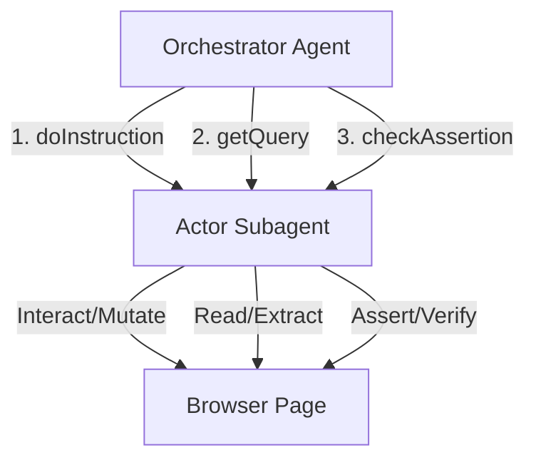
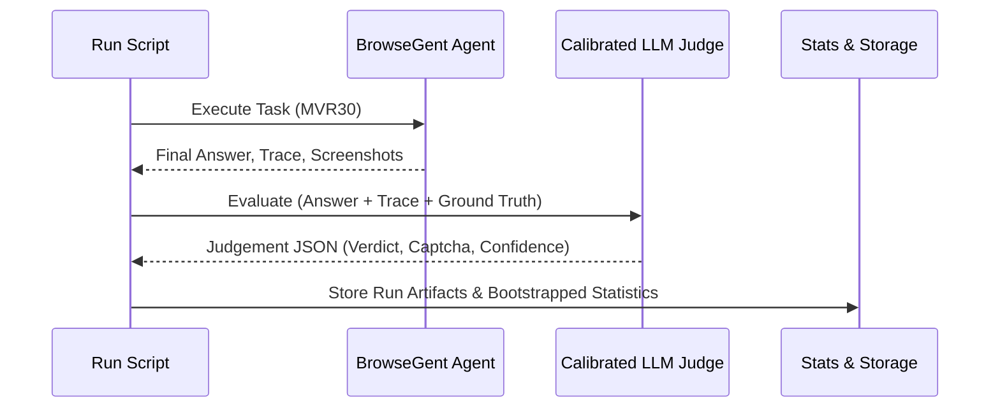

# BrowseGent SOTA Upgrades and Rigorous Benchmark Design Spec

This document outlines the architectural changes for **Track A (Improve BrowseGent)** and **Track B (Fix Benchmark Method)**. The goal is to evolve BrowseGent's navigation loop into a structured, token-efficient system with high extraction accuracy, while introducing a rigorous, variance-aware benchmark methodology.

---

## Track A: Improve BrowseGent

### 1. The `do / get / check` Execution Paradigm
Currently, BrowseGent blends reasoning, HTML parsing, action execution, and validation in a single continuous agent loop. This leads to context bloating, token inefficiency, and finalization errors (e.g., ArXiv returning a URL instead of a paper title).

We will separate BrowseGent's interaction into three distinct, declarative commands executed by a lightweight, fast browser actor:



1. **`do(instruction)`**: Performs state-mutating actions (clicks, keyboard input, navigation, scroll). It returns an action execution status (e.g., `"success" | "element_not_found" | "timeout"`).
2. **`get(query)`**: Extracts data, text, or values from the current page. It is strictly read-only and does not mutate the page state or trigger navigations. It returns the extracted data string.
3. **`check(assertion)`**: Evaluates a boolean assertion on the page state (e.g., verifying a warning box disappeared or a table populated). It returns a boolean.

#### Core Loop Architecture
* The **Orchestrator Agent** manages the high-level plan, history, and goals. It delegates concrete actions to the **Browser Actor Subagent** via `do`, `get`, or `check`.
* **State Isolation**: The Browser Actor only receives the *current* page state and the *single* instruction, preventing historic prompt leakage and context rot.

---

### 2. Accessibility-Tree-First Representation (A11y-First)
To improve token efficiency (GitHub task used 1.09M planner input bytes) and selector accuracy, BrowseGent will switch from passing raw HTML/CDP lists to a distilled **Accessibility Tree**.

#### Tree Compaction Rules:
1. **Prune Layout Containers**: Remove `div`, `span`, `section` elements that only serve visual positioning and contain no text or interactive role.
2. **Expose Semantic Roles & States**: Serialize only interactive/meaningful roles (`button`, `link`, `textbox`, `combobox`, `dialog`, `checkbox`, `gridcell`) and states (`focused`, `expanded`, `checked`, `disabled`).
3. **Simplified Numeric IDs**: Assign temporary sequential integers to interactive nodes (e.g., `[0] button "Search"`, `[1] textbox "Username"`). The Orchestrator references these simple IDs in its tool calls (e.g., `click(0)`, `type(1, "my-user")`), which is more reliable than raw CSS selectors or coordinates.

#### Expected Token Reduction:
* HTML DOM representation: ~20,000 to ~80,000 tokens per step.
* Distilled A11y Tree: ~800 to ~3,000 tokens per step.
* **Reduction: >90% token savings**, bringing GitHub execution costs down and preventing context window truncation.

---

### 3. Result Ranking & List Extraction
To solve the GitHub task failure (choosing a repo with 20 stars instead of the highest-starred one), we need dedicated list/table extraction capabilities.

* **List Extraction Protocol**: When the Orchestrator needs to select the "best" result from a list or table:
  1. It invokes `get("Extract search results containing repository name, star count, and description")`.
  2. The Actor returns a structured JSON list of visible results:
     ```json
     [
       {"id": "[12]", "repo": "resource-watch/resource-watch", "stars": 1200, "description": "Global datasets..."},
       {"id": "[15]", "repo": "akshaysonvane/Climate-Change-Data-Analytics", "stars": 20, "description": "Climate change visualizer..."}
     ]
     ```
  3. The Orchestrator parses this JSON, applies sorting logic (e.g., sorting by stars descending), identifies `[12]` as the correct choice, and issues `do("click element [12]")`.
* This replaces vibes-based clicking with precise, data-driven decision-making.

---

### 4. Environment-Block & CAPTCHA Handling
Allrecipes failed because the planner hit a CAPTCHA block and had no recovery mechanism, leading to invalid action retry loops.

* **Detection Layer**: The A11y parser and observation engine will scan for CAPTCHA/bot-detection indicators (e.g., Cloudflare Turnstile, reCAPTCHA iframe, access denied warnings, or 403 status codes).
* **Signal Flagging**: If detected, the page observation is flagged with `reached_captcha: true`.
* **Graceful Recovery Flow**:
  1. The Planner receives the CAPTCHA flag and immediately halts automated tool attempts to avoid trigger-happy bans.
  2. The loop raises `escalate: "captcha"`.
  3. If running headed/interactive, it pauses to request human solving or signals an external captcha-solving middleware. If running headless/automated, it marks the task classification as `environment_block` and terminates cleanly.

---

## Track B: Fix Benchmark Method (MVR30 Validated)

Current benchmark verification is too permissive (internal `passed:true` rate of 80% vs WebVoyager strict rate of 20%). We need statistical rigor and strict auto-evaluators.



### 1. MVR30 Validated Task Pool
We will construct a standardized **MVR30** benchmark suite representing 30 web tasks across diverse domains (Google Search/Maps, Amazon, Booking, GitHub, ArXiv, Wolfram, Allrecipes, etc.).
* **Dynamic Date Normalizer**: Tasks asking for temporal content (e.g., "flight for tomorrow") are translated relative to the execution timestamp, avoiding stale references.
* **Ground Truth Rubrics**: Every task is paired with:
  * Reference answers (gold standard).
  * Verdict matching rules (Exact match, Keyword match, or Semantic subset match).
  * Expected page assertions.

---

### 2. Calibrated LLM Judge Schema
We will implement an automated judge using a separate model (e.g., Gemini 2.5 Flash / Claude 3.5 Sonnet) calibrated against human-annotated traces. The judge must return a structured JSON conforming to the following schema:

```json
{
  "$schema": "http://json-schema.org/draft-07/schema#",
  "title": "JudgementResult",
  "type": "object",
  "properties": {
    "verdict": {
      "type": "boolean",
      "description": "True if the agent successfully fulfilled all aspects of the user goal and matched the ground truth."
    },
    "confidence": {
      "type": "string",
      "enum": ["high", "medium", "low"],
      "description": "Judge confidence in the evaluation verdict."
    },
    "failure_reason": {
      "type": "string",
      "description": "Detailed description of what failed (required if verdict is false)."
    },
    "impossible_task": {
      "type": "boolean",
      "description": "True if the website was broken, required missing credentials, or had stale links that made the task impossible."
    },
    "reached_captcha": {
      "type": "boolean",
      "description": "True if a CAPTCHA or bot-detection block was encountered."
    },
    "reference_match_type": {
      "type": "string",
      "enum": ["exact", "partial", "mismatch"],
      "description": "How closely the agent's output aligned with the ground truth reference."
    }
  },
  "required": ["verdict", "confidence", "impossible_task", "reached_captcha", "reference_match_type"]
}
```

#### Ground Truth Precedence:
The judge is explicitly instructed: **Ground truth is absolute.** If the agent's final answer does not contain the verified ground truth value (e.g., returning a description instead of a phone number, or listing a wrong star count), the verdict MUST be `false`.

---

### 3. Comprehensive Logging & Run Records
Every benchmark run will compile a self-contained execution package stored in `logs/benchmark/MVR30/<run_id>/`:
* **Trace JSON**: Full list of actions, observations, input prompt sizes, and output tokens.
* **Screenshots**: High-resolution image capture of the browser view at each step.
* **Judgement JSON**: The output of the calibrated judge.
* **Performance Metrics**: Cost in USD, total duration, step count, and RPM pacing stats.

---

### 4. Statistical Rigor & Variance Handling
Web benchmarks suffer from live site drift, network latency, and LLM temperature fluctuations.
* **Slice Retries (3x)**: When evaluating a release branch, the MVR30 suite must be executed **3 times** consecutively.
* **Metric Reporting**: We will report three metrics:
  1. **Strict Success Rate**: Verdicts with no human correction or lenient overlaps.
  2. **Environment-Adjusted Success Rate**: Excluding tasks flagged with `reached_captcha: true` or `impossible_task: true`.
  3. **Variance**: Reporting mean success rate ± standard deviation (e.g., `73.3% ± 4.7%`) rather than a single peak run score.

---

## Verification Plan

### Automated Tests
1. **Accessibility tree compiler tests**: Verify `A11yTreePruner` correctly compresses deep HTML trees while retaining roles and simplified IDs.
2. **Parser schema validator tests**: Unit test `JudgementResult` validation against the JSON schema.
3. **Pacing rate limiter tests**: Confirm API request spacing respects pacing parameters.

### Manual Verification
1. **Calibrated Judge Evaluation**: Run the judge on the 5 traces from the last frozen run (`webvoyager_lite_1780664138248`) and confirm it correctly flags ArXiv as `partial/fail` (due to URL return) and GitHub as `mismatch/fail` (wrong repo), aligning perfectly with our manual audit.
2. **CAPTCHA Bypass & Paused State**: Trigger a manual block page and verify the agent loop pauses/escalates rather than looping.
