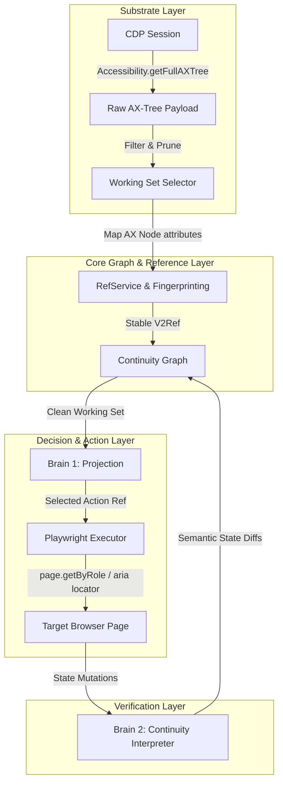

# Hybrid AX-Tree + Continuity Graph Architecture Specification

This specification outlines the transition from a custom injected JavaScript DOM crawler to a **Native Accessibility Tree (AX-Tree) Substrate** integrated with the existing **Brain 1 / Brain 2 / Continuity Graph** architecture in BrowseGent v2.

---

## 1. Executive Summary & Problem Statement

BrowseGent v2 currently uses an injected JavaScript crawler (`ObservationService.ts`) to extract interactive and readable elements from the DOM. While this approach is independent of the browser engine, it introduces several production-grade limitations:
- **Label Mismatches**: Custom JS emulation of accessible names and labels is fragile (e.g., failing to distinguish between identical audio buttons like UK vs. US pronunciations).
- **Shadow DOM & Iframes**: Crawling elements across closed shadow roots or cross-domain iframe boundaries requires heavy JS hacks and has poor reliability.
- **Locator Fragility**: Resolving emulated refs back to physical elements via selector candidates frequently results in detaches or ambiguity during dynamic page updates.

### The Hybrid Solution
Instead of abandoning the **Brain + Graph** model, we will replace the custom JS crawler with Chromium's native Accessibility Tree API (`Accessibility.getFullAXTree`) at the substrate layer. 
1. The native layout engine computes perfect semantic labels, roles, and ARIA states in C++.
2. A mapper processes the raw AX-Tree in Node.js, filters it down to a goal-relevant **Working Set** (matching the current token-saving budget), and maps nodes to stable `V2Ref`s.
3. Element interaction is resolved using Playwright's highly optimized native accessibility locators (`page.getByRole`).

---

## 2. Architectural Components & Data Flow



### 2.1 Native AX-Tree Capture
*   **Method**: Utilize the Chrome DevTools Protocol (`CDPSession`) to call `Accessibility.getFullAXTree` at the beginning of each observation cycle.
*   **Payload structure**: Returns a tree of `AXNode` elements containing:
    *   `nodeId` & `backendDOMNodeId` (primary keys mapping back to DOM).
    *   `role` (e.g., `button`, `link`, `textbox`).
    *   `name` (the calculated accessible label).
    *   `description` & `value`.
    *   `states` (e.g., `focused`, `expanded`, `disabled`, `checked`, `hidden`).

### 2.2 AX-Tree Filtering & Working Set Composition
*   To keep token usage identical to the current system, the `PlannerWorkingSetSelector` will prune the raw AX-Tree:
    *   **Keep**: Nodes with interactive roles (buttons, textboxes, comboboxes, links) that are visible and not disabled.
    *   **Keep**: Nodes containing meaningful readable text (e.g., headers, paragraphs) near interactive boundaries to serve as evidence.
    *   **Discard**: Layout wrappers, generic divs, static icons, and hidden nodes.

### 2.3 Playwright Native ARIA Locator Mapping
Instead of relying on fragile CSS/XPath fingerprints, the substrate maps `V2Ref` actions to Playwright's native ARIA locators.
*   **Example**: If a ref has `role: 'button'` and `name: 'Listen to UK pronunciation'`, the resolver will execute:
    ```typescript
    page.getByRole('button', { name: 'Listen to UK pronunciation', exact: true });
    ```
*   **Fallback**: If the semantic locator is ambiguous, the system resolves the element using the `backendDOMNodeId` via CDP's node description APIs.

---

## 3. Impact Analysis

| Metric / Aspect | Custom JS Crawler (Current) | Hybrid AX-Tree Substrate (Proposed) | Impact & Justification |
| :--- | :--- | :--- | :--- |
| **Token Cost (LLM)** | Low (Filtered to Working Set). | Low (Filtered to Working Set). | **No Change**: The LLM receives the same cleaned JSON schema. |
| **Capture Latency** | 70ms - 230ms (recursive JS traversal + sequential `describeNode` loops). | 15ms - 120ms (single native C++ serialization call). | **Improvement**: Reduces injection overhead and eliminates serial websocket roundtrips. |
| **Semantic Accuracy** | Moderate/Low (Emulated in JS, misses complex ARIA and text associations). | **100% (Native Chromium C++ implementation)**. | **Massive Improvement**: Prevents loop failures on identical buttons (e.g., UK/US audio). |
| **Shadow DOM / Iframes** | Requires manual traversal recursion. | Traversed natively by Chromium. | **Improvement**: Bulletproof coverage of modern web architectures. |
| **Environment Stealth** | Medium (Requires injected script execution). | High (Read-only native CDP queries). | **Improvement**: Reduces detectable runtime JS footprints inside the page context. |

---

## 4. Key Implementation Tasks

### 4.1 Substrate Layer Updates
*   **Modify [ObservationService.ts](file:///d:/BrowseGent/src/v2/substrate/ObservationService.ts)**:
    *   Replace `COLLECT_INTERACTIVE_ELEMENTS_SCRIPT` evaluation with a call to `Accessibility.getFullAXTree` via `CdpBridge`.
    *   Map the returned `AXNode` array into our unified `V2Ref` format.
    *   Map `backendDOMNodeId` directly to `backendNodeId` for continuity tracking.
*   **Modify [RefResolver.ts](file:///d:/BrowseGent/src/v2/substrate/RefResolver.ts)**:
    *   Implement resolution using Playwright's `page.getByRole` first, falling back to backend ID query if role/name is ambiguous.

### 4.2 Brain 2 Mutation Tracker Updates
*   **Modify [ContinuityInterpreter.ts](file:///d:/BrowseGent/src/v2/brain2/ContinuityInterpreter.ts)**:
    *   Compare the native AX-Tree attributes (like `disabled`, `expanded`, `focused`) before and after the action.
    *   Feed these highly accurate transition variables into `calculateProgressStrength`.

---

## 5. Verification & Test Plan

1.  **Automated Unit Tests**:
    *   Write mock AX-Tree payloads containing shadow DOM elements and verify `ObservationService` parses them correctly.
    *   Verify `RefResolver` correctly translates AX properties into Playwright `getByRole` locators.
2.  **Benchmark/Integration Tests**:
    *   Re-run the **Cambridge Dictionary** benchmark task.
    *   Verify that the agent correctly distinguishes the UK vs. US pronunciation buttons and completes the task in a single iteration without loops.
