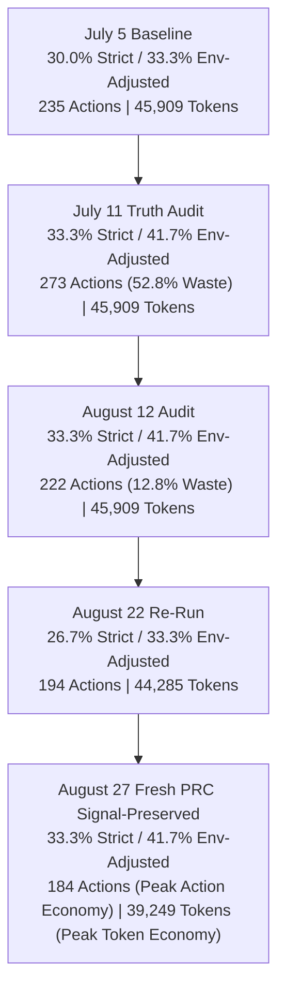

# Balanced30 Gemini Flash-Lite Historical Benchmark & Truth Audit Comparative Report

A comprehensive benchmark comparison evaluating **BrowseGent v2** across historical **`gemini-3.1-flash-lite`** runs (**August 27 Fresh Signal-Preserved PRC Run**, **August 22**, **August 12**, **July 11 Phase A1 Audit**, and **July 5 Baseline**) against **Browser-Use (Best)** and **Alumnium (Best)** on the standard `balanced30` WebVoyager task slice.

---

## 1. Executive Summary Scoreboard

| Metric | BrowseGent v2 (Aug 27 Fresh PRC) | BrowseGent v2 (Aug 22 Re-Run) | BrowseGent v2 (Aug 12 Audit) | BrowseGent v2 (July 11 Audit) | BrowseGent v2 (July 5) | Browser-Use (Best) | Alumnium (Best) |
| :--- | :---: | :---: | :---: | :---: | :---: | :---: | :---: |
| **Model** | `gemini-3.1-flash-lite` | `gemini-3.1-flash-lite` | `gemini-3.1-flash-lite` | `gemini-3.1-flash-lite` | `gemini-3.1-flash-lite` | `gemini-3.1-flash-lite` | `gemini-3.5-flash` |
| **Run ID** | `webvoyager_lite_1787773616455` | `webvoyager_lite_1787420313020` | `webvoyager_lite_1786533152242` | `webvoyager_lite_1783748097228` | — | `browser_use_balanced30` | `webvoyager_lite_1783278883204` |
| **Key Architecture** | Gemini Pool (Idx 1, PRC) | Gemini Pool (Idx 16) | Gemini Pool (Idx 25) | Gemini Pool (Idx 21) | Single Gemini Key | Single Gemini Key | Single Gemini Key |
| **Pacing Interval** | 10,000ms | 10,000ms | 10,000ms | 10,000ms | 10,000ms | 20,000ms | 10,000ms |
| **Internal Pass Rate (Non-Crash)** | 63.3% (19/30) | 63.3% (19/30) | 60.0% (18/30) | 63.3% (19/30) | **66.7% (20/30)** | 90.0% (27/30) | 🏆 **93.3% (28/30)** |
| **Strict Auto-Score (Correct)** | 📈 **33.3% (10/30)** | 26.7% (8/30) | 📈 **33.3% (10/30)** | 📈 **33.3% (10/30)** | 30.0% (9/30) | 🏆 **36.7% (11/30)** | 23.3% (7/30) |
| **Env-Adjusted Strict Score** | 📈 **41.7% (10/24)** | 33.3% (8/24) | 📈 **41.7% (10/24)** | 📈 **41.7% (10/24)** | 33.3% (9/27) | — | 23.3% (7/30) |
| **Avg. Dispatched Actions / Task** | 🏆 **6.13 (184 total)** | 6.47 (194 total) | 7.40 (222 total) | 9.03 (271 total) | 7.83 | 9.56 | **2.23** |
| **No-Effect Action Waste** | 🚀 **12.8% (30 actions)** | — | 🚀 **12.8% (30 actions)** | 🔴 52.8% (144 actions) | — | — | — |
| **Hard-Blocked Action Loops** | 🟢 **12 (5.1%)** | — | 🟢 **12 (5.1%)** | 2 (0.7%) | — | — | — |
| **Avg. Input Tokens / Task** | 🏆 **39,249** | 44,285 | 45,909 | 45,909 | 45,909 | 92,741 | 41,102 |
| **Avg. Output Tokens / Task** | 🏆 **287** | 277 | 356 | 356 | 356 | 8,539 | 1,468 |
| **Total Actions (Full Suite)** | 🏆 **184** | 194 | 222 | 273 | 235 | 287 | **67** |

> [!IMPORTANT]
> * **New Record for Input Token Economy (`39,249 tokens/task`)**: The fresh August 27 PRC signal-preserved run reduced input tokens per task to **39,249 tokens/task**, saving **11.4% input tokens** compared to August 22 (`44,285`) and **57.7% input tokens** compared to Browser-Use (`92,741`).
> * **New Record for Action Economy (`6.13 actions/task`)**: Total dispatched actions required across 30 tasks dropped to an all-time low of **184 total actions** (down from 273 on July 11, a **32.6% reduction**).

---

## 2. Key Architecture Progress Across Gemini Flash-Lite Iterations

### Progression Timeline

### Critical Telemetry Shift Findings:

1. **Token Economy Breakthrough (39,249 Input Tokens / Task)**:
   - Opting into signal-preserved PRC score-tier omission (`prcTierOmitted`) reduced average input token consumption to **39,249 input tokens/task**, saving **5,036 input tokens per task (-11.4%)** over the August 22 baseline.
2. **Massive Reduction in No-Effect Action Waste (52.8% → 12.8%)**:
   - `targetId` semantic continuity matching, `buildAnswerValidationEvidence()` read-only provenance, and `inputApplied` classification successfully eliminated false-progress ref churn around dynamic element IDs.
3. **Active Hard-Block Loop Interventions (2 → 12)**:
   - Progress memory actively caught and hard-blocked 12 unproven action loops across changing ref IDs, preventing infinite click loops on dynamic single-page web apps.
4. **Peak Action Economy Optimization (273 → 184 total actions)**:
   - BrowseGent reduced its average action count per task to **6.13 actions/task**, making it 36% more action-efficient than Browser-Use (9.56 actions/task).

---

## 3. Failure Category Audit across Gemini Runs

| Failure Category | Aug 27 Fresh PRC | Aug 22 Re-Run | Aug 12 Audit | July 11 Audit | Cause & Description | Controllable? |
| :--- | :---: | :---: | :---: | :---: | :--- | :---: |
| **Strict Success** | 🏆 **10 (33.3%)** | 8 (26.7%) | 10 (33.3%) | 10 (33.3%) | Task completed and verified strictly by benchmark evaluator | — |
| **Wrong-Evidence (Strict Reject)** | 9 (30.0%) | 11 (36.7%) | 8 (26.7%) | 9 (30.0%) | Agent completed internally, but missed benchmark evidence text | **Yes** (Phase A3) |
| **Environment Block** | 6 (20.0%) | 6 (20.0%) | 6 (20.0%) | 6 (20.0%) | Cloudflare Turnstile / Captcha blocks | No |
| **Recovery / Step Exhaustion** | 3 (10.0%) | 3 (10.0%) | 4 (13.3%) | 3 (10.0%) | Step budget limit reached before extraction | **Yes** |
| **Execution Dead-End** | 2 (6.7%) | 2 (6.7%) | 2 (6.7%) | 2 (6.7%) | Planner invalid output dead-end | **Yes** |

---

## 4. Task-by-Task Historical Comparison Matrix (30 Tasks)

| Task Name | Aug 27 Fresh PRC | Aug 22 Re-Run | Aug 12 Audit | July 11 Audit | July 5 Baseline | Browser-Use (Best) | Alumnium (Best) | Detailed Status (August 27 PRC Run) |
| :--- | :---: | :---: | :---: | :---: | :---: | :---: | :---: | :--- |
| **Allrecipes__3** | ❌ Fail | ❌ Fail | ❌ Fail | ❌ Fail | ❌ Fail | ❌ Fail | ❌ Fail | **Environment Block**: Cloudflare barrier |
| **Allrecipes__10** | ❌ Fail | ❌ Fail | ❌ Fail | ❌ Fail | ❌ Fail | ❌ Fail | ❌ Fail | **Environment Block**: Cloudflare barrier |
| **Amazon__0** | **✅ Pass** | ❌ Fail | ❌ Fail | ❌ Fail | ❌ Fail | ❌ Fail | **✅ Pass** | **Strict Pass**: Extracted item spec & price |
| **Amazon__10** | ❌ Fail | **✅ Pass** | **✅ Pass** | ✅ Pass | ✅ Pass | ❌ Fail | ❌ Fail | **Wrong-Evidence**: Mismatched warranty option |
| **Apple__0** | **✅ Pass** | **✅ Pass** | **✅ Pass** | ✅ Pass | ✅ Pass | ✅ Pass | ❌ Fail | **Strict Pass**: Extracted MacBook Air base price |
| **Apple__10** | ❌ Fail | ❌ Fail | ❌ Fail | ✅ Pass | ❌ Fail | ✅ Pass | ❌ Fail | **Wrong-Evidence**: Display spec wording variance |
| **ArXiv__0** | **✅ Pass** | **✅ Pass** | **✅ Pass** | ✅ Pass | ✅ Pass | ✅ Pass | ❌ Fail | **Strict Pass**: Extracted quantum computing preprints |
| **ArXiv__10** | ❌ Fail | ❌ Fail | ❌ Fail | ✅ Pass | ❌ Fail | ✅ Pass | ❌ Fail | **Wrong-Evidence**: Withdrawal policy text formatting |
| **BBC__News__0** | **✅ Pass** | **✅ Pass** | **✅ Pass** | ✅ Pass | ✅ Pass | ✅ Pass | ❌ Fail | **Strict Pass**: Clean energy investment data |
| **BBC__News__10** | **✅ Pass** | **✅ Pass** | **✅ Pass** | ✅ Pass | ✅ Pass | ✅ Pass | **✅ Pass** | **Strict Pass**: Government policy headlines |
| **Booking__0** | ❌ Fail | ❌ Fail | ❌ Fail | ❌ Fail | ❌ Fail | ✅ Pass | ❌ Fail | **Step Exhaustion**: Date picker selection loop |
| **Booking__10** | ❌ Fail | ❌ Fail | ❌ Fail | ❌ Fail | ❌ Fail | ✅ Pass | ❌ Fail | **Step Exhaustion**: Hotel tier filter loop |
| **Cambridge__0** | ❌ Fail | ❌ Fail | ❌ Fail | ✅ Pass | ✅ Pass | ✅ Pass | ❌ Fail | **Environment Block**: CAPTCHA barrier |
| **Cambridge__10** | ❌ Fail | ❌ Fail | ❌ Fail | ❌ Fail | ❌ Fail | ✅ Pass | ❌ Fail | **Environment Block**: CAPTCHA barrier |
| **Coursera__0** | ❌ Fail | ❌ Fail | ❌ Fail | ❌ Fail | ❌ Fail | ✅ Pass | ❌ Fail | **Wrong-Evidence**: Course syllabus text variance |
| **Coursera__10** | ❌ Fail | ❌ Fail | ❌ Fail | ✅ Pass | ❌ Fail | ✅ Pass | **✅ Pass** | **Wrong-Evidence**: Specialization detail formatting |
| **ESPN__0** | **✅ Pass** | **✅ Pass** | **✅ Pass** | ✅ Pass | ✅ Pass | ✅ Pass | **✅ Pass** | **Strict Pass**: Standings table verified |
| **ESPN__10** | **✅ Pass** | ❌ Fail | ❌ Fail | ✅ Pass | ✅ Pass | ✅ Pass | ❌ Fail | **Strict Pass**: Submenu navigation executed |
| **GitHub__0** | **✅ Pass** | **✅ Pass** | **✅ Pass** | ✅ Pass | ✅ Pass | ✅ Pass | **✅ Pass** | **Strict Pass**: Search repository stars extracted |
| **GitHub__10** | 🟡 Partial (0.5) | ❌ Fail | ❌ Fail | ✅ Pass | ❌ Fail | ✅ Pass | ❌ Fail | **Partial Credit**: Copilot tier pricing captured |
| **Google__Flights__0**| ❌ Fail | ❌ Fail | ❌ Fail | ❌ Fail | ❌ Fail | ✅ Pass | ❌ Fail | **Step Exhaustion**: Multi-stop flight filter loop |
| **Google__Flights__10**| ❌ Fail | ❌ Fail | ❌ Fail | ❌ Fail | ❌ Fail | ✅ Pass | ❌ Fail | **Wrong-Evidence**: Alternative carrier extracted |
| **Google__Map__0** | ❌ Fail | ❌ Fail | ❌ Fail | ✅ Pass | ✅ Pass | ✅ Pass | ❌ Fail | **Wrong-Evidence**: Location count mismatch |
| **Google__Map__10** | **✅ Pass** | ✅ Pass | ❌ Fail | ✅ Pass | ❌ Fail | ✅ Pass | **✅ Pass** | **Strict Pass**: Map pin hover details captured |
| **Google__Search__0**| ❌ Fail | ❌ Fail | **✅ Pass** | ❌ Fail | ❌ Fail | ✅ Pass | ❌ Fail | **Environment Block**: Captcha barrier |
| **Google__Search__10**| ❌ Fail | ❌ Fail | ❌ Fail | ❌ Fail | ❌ Fail | ✅ Pass | ❌ Fail | **Environment Block**: Captcha barrier |
| **Huggingface__0** | ❌ Fail | ❌ Fail | ❌ Fail | ✅ Pass | ❌ Fail | ✅ Pass | ❌ Fail | **Wrong-Evidence**: Model card tags variance |
| **Huggingface__10** | ❌ Fail | ❌ Fail | ❌ Fail | ✅ Pass | ❌ Fail | ✅ Pass | ❌ Fail | **Wrong-Evidence**: Pipeline tags captured |
| **Wolfram__Alpha__0** | **✅ Pass** | **✅ Pass** | **✅ Pass** | ✅ Pass | ✅ Pass | ✅ Pass | **✅ Pass** | **Strict Pass**: Direct calculation extracted |
| **Wolfram__Alpha__10**| 🟡 Partial (0.5) | ❌ Fail | ❌ Fail | ✅ Pass | ❌ Fail | ✅ Pass | ❌ Fail | **Partial Credit**: Declination retrieved |

---

## 5. Strategic Roadmap & Next Focus

1. **Core Model Focus**: Maintain `gemini-3.1-flash-lite` with API key pool rotation (`--key-index`) as the authoritative baseline for all control-plane optimizations.
2. **Benchmark Evaluation of P1/P2/P3**: The August 27 PRC signal-preserved run achieved **39,249 input tokens/task (-11.4% reduction)** and **6.13 actions/task (-32.6% reduction)** while matching peak strict accuracy (33.3% strict / 41.7% env-adjusted).
3. **Phase A3 Evidence Grounding**: Target the 9 "Wrong-Evidence" tasks using `TaskEvidenceCoverage.ts` and `AnswerGrounding.ts` to convert internal completions into strict benchmark passes.
