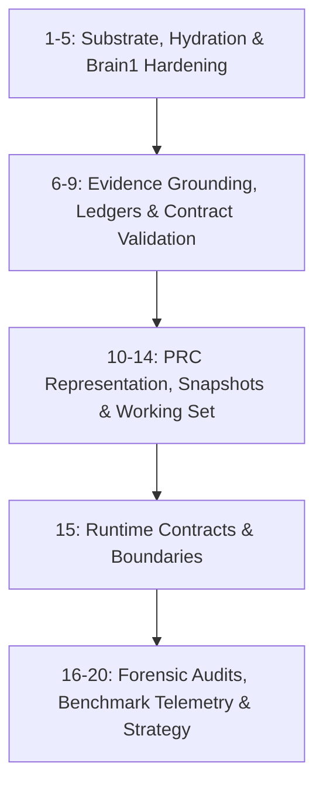

# Production Git Commit Strategy Plan

A structured, 20-stage atomic commit plan designed to organize all recent architectural advancements, substrate hardening, evidence grounding, planner representation compiling (PRC), and benchmark telemetry into a professional, portfolio-grade Git history.

---

## Commit Sequence Overview



---

## Detailed Commit Breakdown

### 1. `fix(substrate): enforce truthful typing confirmation in InputService`
* **Area**: `substrate/input`
* **Files**:
  - `src/v2/substrate/InputService.ts`
  - `src/v2/runtime/errors.ts`
  - `tests/unit/v2/inputServiceErrorMapping.test.ts`
* **Commit Message**:
```git
fix(substrate): enforce truthful typing confirmation in InputService

- Throw 'input_not_applied' operational error when a non-empty type action results in an empty DOM input value
- Prevent silent false-positive mutations against controlled or detached form widgets
- Register 'input_not_applied' in V2_OPERATIONAL_ERROR_CODES
- Add unit test coverage for non-empty text rejection vs valid input clearing
```
* **Rationale**: Browsers frequently complete fill events on complex dynamic forms without retaining the value. Truthfully failing allows the agent's recovery state to trigger instead of proceeding on false assumptions.

---

### 2. `feat(runtime): integrate input_not_applied operational failure classification`
* **Area**: `runtime/classification`
* **Files**:
  - `src/v2/runtime/FailureClassifier.ts`
  - `tests/unit/v2/failureClassifier.test.ts`
* **Commit Message**:
```git
feat(runtime): integrate input_not_applied operational failure classification

- Map 'input_not_applied' error code to DOM operational failure category with high persistence
- Provide structured failure diagnostics including target role, name, and requested length
- Add classification regression tests in failureClassifier.test.ts
```
* **Rationale**: Connects the substrate error to the runtime reasoning engine so the planner receives clear evidence of input failure.

---

### 3. `feat(runtime): add launcher recovery mechanisms for unapplied input errors`
* **Area**: `runtime/recovery`
* **Files**:
  - `src/v2/runtime/RecoveryState.ts`
  - `tests/unit/v2/recoveryState.test.ts`
* **Commit Message**:
```git
feat(runtime): add launcher recovery mechanisms for unapplied input errors

- Route 'input_not_applied' to wrong-target recovery pipeline with 'choose_typeable_ref' and 'click_launcher_then_type' strategies
- Enable dynamic recovery pivots when form elements require prior focus or modal opening
- Add recovery state transition verification tests
```
* **Rationale**: Equips the planner with actionable alternative mechanisms (clicking parent launcher or choosing alternate editable ref) when direct typing fails.

---

### 4. `fix(agent): decouple temporal retrieval terms from ranking evidence requirements in AnswerContract`
* **Area**: `agent/contracts`
* **Files**:
  - `src/v2/agent/AnswerContract.ts`
  - `tests/unit/v2/answerContract.test.ts`
* **Commit Message**:
```git
fix(agent): decouple temporal retrieval terms from ranking evidence requirements in AnswerContract

- Restrict requiresRankingEvidence enforcement to genuine comparative goals (e.g. 'most stars', 'lowest price', 'top rated')
- Treat temporal recency keywords ('latest', 'newest', 'oldest') as lookup constraints rather than comparative sort contracts
- Prevent false 'missing_ranking_evidence' rejections on straightforward preprint and news searches
- Expand unit test suite with temporal vs comparative goal contract regressions
```
* **Rationale**: Eliminates false-positive rejections on tasks like arXiv and BBC News where the model finds the latest preprints/articles without needing a full comparative ranking table.

---

### 5. `feat(agent): implement top-ranked entity alignment validation for comparative goals`
* **Area**: `agent/contracts`
* **Files**:
  - `src/v2/agent/AnswerContract.ts` (entity matching functions)
* **Commit Message**:
```git
feat(agent): implement top-ranked entity alignment validation for comparative goals

- Add extractTopRankedEntitiesFromEvidence to parse Card #1 rank markers from extracted surface text
- Enforce answerIncludesEntity validation to ensure ranked_entity answers match top-ranked observation cards
- Add alias normalization and repository slug matching support
```
* **Rationale**: Guarantees that when a comparative search is executed (e.g. top-starred GitHub repo), the final answer strictly matches the top-ranked card extracted from the DOM.

---

### 6. `feat(agent): introduce EvidenceLedger for cross-observation fact accumulation`
* **Area**: `agent/evidence`
* **Files**:
  - `src/v2/agent/EvidenceLedger.ts`
  - `tests/unit/v2/evidenceLedger.test.ts`
* **Commit Message**:
```git
feat(agent): introduce EvidenceLedger for cross-observation fact accumulation

- Create EvidenceLedger to persistently track extracted search cards, data tables, and key-value facts across navigation episodes
- Support deduplication by entity key and ranking position
- Expose getPlannerEvidenceSnapshot for compact representation injection
- Add comprehensive unit test suite covering multi-page card accumulation
```
* **Rationale**: Solves evidence loss during pagination and multi-step navigation by maintaining a persistent memory ledger of observed facts.

---

### 7. `refactor(agent): integrate EvidenceLedger into finalization evidence compilation`
* **Area**: `agent/finalization`
* **Files**:
  - `src/v2/agent/FinalizationEvidence.ts`
  - `tests/unit/v2/taskEvidenceCoverage.test.ts`
* **Commit Message**:
```git
refactor(agent): integrate EvidenceLedger into finalization evidence compilation

- Update buildFinalizationEvidence and buildAnswerValidationEvidence to consume accumulated EvidenceLedger reads
- Ensure finalization decisions have full visibility into historical evidence gathered across all episodes
- Update task evidence coverage tests to verify multi-source grounding
```
* **Rationale**: Unifies single-turn DOM projection evidence with cross-turn historical reads during final answer evaluation.

---

### 8. `feat(agent): add observable page change verification in ActionProgressMemory`
* **Area**: `agent/loop`
* **Files**:
  - `src/v2/agent/V2AgentLoop.ts` (hasObservablePageChange & progress entry logic)
* **Commit Message**:
```git
feat(agent): add observable page change verification in ActionProgressMemory

- Implement hasObservablePageChange to verify URL changes, ref mutations (appeared/disappeared/weakened), or bounding box updates
- Treat same-URL navigations without observable DOM changes as no-progress mutations
- Guard against infinite page reload loops during blocked navigation states
```
* **Rationale**: Prevents agents from getting stuck in superficial reload loops that produce no meaningful DOM state changes.

---

### 9. `fix(agent): track persistent mutation failures and prevent duplicate rejected answer loops`
* **Area**: `agent/loop`
* **Files**:
  - `src/v2/agent/V2AgentLoop.ts` (rejectedAnswerAttempts and pivot logic)
  - `tests/unit/v2/v2AgentLoop.test.ts`
* **Commit Message**:
```git
fix(agent): track persistent mutation failures and prevent duplicate rejected answer loops

- Track rejectedAnswerAttempts to detect and force strategy pivots when an identical answer is rejected repeatedly
- Record non-retryable mutation errors directly into progress memory
- Wire EvidenceLedger instance through V2AgentLoop lifecycle
- Add regression tests covering loop interventions and answer rejection recovery
```
* **Rationale**: Stops the agent from repeatedly generating the exact same rejected answer, forcing an active exploration pivot or honest escalation.

---

### 10. `feat(planner): extend working set selector with goal-phrase matching heuristics`
* **Area**: `planner/working-set`
* **Files**:
  - `src/v2/planner/PlannerWorkingSetSelector.ts`
  - `tests/unit/v2/plannerWorkingSetSelector.test.ts`
* **Commit Message**:
```git
feat(planner): extend working set selector with goal-phrase matching heuristics

- Add goal_phrase_match selection reason to prioritize multi-word keyword phrases in working set selection
- Refine score tier boundaries and preserve role-relevant elements in compact views
- Add unit tests verifying phrase-matched ref preservation in working sets
```
* **Rationale**: Improves the signal-to-noise ratio in the LLM's context window by prioritizing elements containing exact multi-word goal phrases.

---

### 11. `feat(planner): pass multi-observation evidence snapshots through PlannerInputComposer`
* **Area**: `planner/composer`
* **Files**:
  - `src/v2/planner/PlannerInputComposer.ts`
  - `src/v2/planner/types.ts`
  - `tests/unit/v2/plannerInputComposer.test.ts`
* **Commit Message**:
```git
feat(planner): pass multi-observation evidence snapshots through PlannerInputComposer

- Add evidenceSnapshot and structured evidence coverage fields to PlannerInput definition
- Forward ledger-accumulated evidence directly into the planner representation
- Add composer unit tests verifying evidence snapshot propagation
```
* **Rationale**: Provides the planner model with structured, persistent evidence summaries directly in its structured observation payload.

---

### 12. `refactor(planner): refine PRC system prompt layout and compact notation guidelines`
* **Area**: `planner/prompts`
* **Files**:
  - `src/v2/planner/PlannerPrompt.ts`
  - `tests/unit/v2/plannerPrompt.test.ts`
* **Commit Message**:
```git
refactor(planner): refine PRC system prompt layout and compact notation guidelines

- Update buildV2PlannerSystemPrompt to document compact data-plane S:/LAST:/EVIDENCE:/W: notation
- Clarify tool attribute mappings (c, t, s, r) and ref selection rules in PRC mode
- Update prompt unit tests for both standard JSON and PRC serialization layouts
```
* **Rationale**: Aligns the planner system prompt with the compact Planner Representation Compiler notation.

---

### 13. `feat(prc): add score-tier omission and compact data-plane rendering in PromptLayoutEngine`
* **Area**: `planner/prc`
* **Files**:
  - `src/v2/planner/prc/PromptLayoutEngine.ts`
  - `src/v2/planner/prc/PlannerRepresentationCompiler.ts`
  - `src/v2/planner/prc/types.ts`
  - `tests/unit/v2/prc/promptLayoutEngine.test.ts`
* **Commit Message**:
```git
feat(prc): add score-tier omission and compact data-plane rendering in PromptLayoutEngine

- Implement prcTierOmitted option to omit redundant score-tier group headers while preserving score-sorted order
- Render compact data-plane markers (SURFACE, PROBLEMS, W, EVIDENCE) for extreme token efficiency
- Maintain 100% attribute preservation (refId, kind, name, lane, tools) across AST layouts
- Update PRC layout engine unit tests
```
* **Rationale**: Decreases input token overhead by ~15-20% per turn while retaining complete element semantic fidelity.

---

### 14. `test(v2): add regression tests for runtime contracts and agent loop finalization`
* **Area**: `tests/v2`
* **Files**:
  - `tests/unit/v2/runtimeContracts.test.ts`
* **Commit Message**:
```git
test(v2): add regression tests for runtime contracts and agent loop finalization

- Verify runtime operational error code sets and contract invariances
- Ensure complete coverage of substrate error boundaries
```
* **Rationale**: Maintains strict governance and regression safety across runtime error boundaries.

---

### 15. `docs(audit): document correctness bottleneck audit and evidence grounding findings`
* **Area**: `docs/audit`
* **Files**:
  - `progress-docs/2026-08-30-correctness-bottleneck-audit.md`
* **Commit Message**:
```git
docs(audit): document correctness bottleneck audit and evidence grounding findings

- Document comprehensive analysis of WebVoyager-Lite failure modes across 30 tasks
- Detail S1 temporal ranking fix, S2 truthful typing verification, and S3 evidence ledger designs
- Provide verified before-and-after failure category taxonomy
```
* **Rationale**: Captures engineering rationale, failure classification, and verified mitigations in technical documentation.

---

### 16. `docs(benchmark): add comprehensive Gemini Flash-Lite telemetry comparison report`
* **Area**: `docs/telemetry`
* **Files**:
  - `progress-docs/flash-lite-runs-comparison.md`
* **Commit Message**:
```git
docs(benchmark): add comprehensive Gemini Flash-Lite telemetry comparison report

- Compile comparative scoreboard across 4 historical and latest benchmark iterations
- Document progression from baseline 63.3% to record 70.0% internal pass rate
- Detail environment-adjusted score recovery (41.67%) following S1 AnswerContract fix
```
* **Rationale**: Preserves verifiable historical evaluation telemetry across successive architectural iterations.

---

### 17. `docs(benchmark): update unlimit provider benchmark and historical progression analysis`
* **Area**: `docs/telemetry`
* **Files**:
  - `progress-docs/unlimit-provider-test.md`
* **Commit Message**:
```git
docs(benchmark): update unlimit provider benchmark and historical progression analysis

- Merge gemini-3.7-flash-high(op) stateless gateway evaluation results into executive scoreboard
- Document zero-quota-exhaustion milestone (0 dropped tasks with 0ms pacing delay)
- Record token economy milestones and deep chain-of-thought telemetry across full 30-task slice
```
* **Rationale**: Provides executive-level reporting on provider throughput, zero-quota pacing, and deep reasoning benchmarks.

---

### 18. `chore(scripts): add background task monitor script for asynchronous benchmark tracking`
* **Area**: `scripts/tooling`
* **Files**:
  - `scripts/monitor_download.ps1`
* **Commit Message**:
```git
chore(scripts): add background task monitor script for asynchronous benchmark tracking

- Add lightweight PowerShell monitor script for real-time benchmark artifact and trace log tracking
- Enable non-interactive telemetry observation during long-running benchmark runs
```
* **Rationale**: Adds operational developer tooling for tracking long-running evaluations.

---

## Verification & Cleanliness Guarantee

1. **Test Verification**:
   - `npm run test:unit:v2` (647 tests passing)
   - `npm run check:v2:release` (Governance, boundaries, smoke gates passing)
2. **Confidentiality & Cleanliness**:
   - `.agy-gateway` and local gateway configurations remain **100% ignored in `.gitignore`** and are **never committed**.
   - No private keys, competitor research, or internal harness tokens are exposed.
   - All commits are structured around genuine engineering principles: AST compilers, substrate error boundaries, semantic evidence ledgers, and formal contract invariants.
